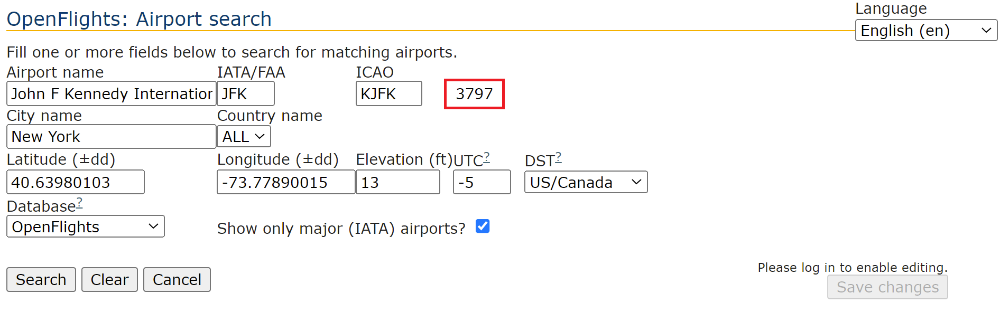

# OpenFlights Dataset Analysis
Do

```bash
$ git clone https://github-dev.cs.illinois.edu/cs225-sp22/harsha4-saraza2-kushal2-mayan3
```
to get a copy of the repository. 

## Licensing
The source of this data is [OpenFlights](openflights.org). This derived work is available to the public MIT license. See [the OpenFlights website](https://openflights.org/data.html#license) for licensing terms.

## Description

With this project, you can determine the following:
1. If an Airport B is reachable from another Airport A with a user-inputted number of stopovers
2. The shortest distance between an Airport A and an Airport B
3. If it is possible to visit one or more of airports Airport A, Airport B, and Airport C more than once

Please note that the OpenFlights dataset we used in creating this project was last updated in June 2014 and thus it—and this project—have purely historical value.

## Building and Running the CLI program

Run the following commands:
```bash
$ make clean
$ make main
$ ./main_output
```

## Building and Running the Test Suite
Run the following commands:
```bash
$ make clean
$ make tests
$ ./test_output
```

## Using the CLI program

OpenFlights Analysis supports the following commands:

`1` - Determine the minimum distance between two airports
```
> 1
```

`2` - Determine if an airport is reachable from a given airport
```
> 2
```

`3` - Determine if, given three or more airports, it is possible to visit at least one airport more than once
```
> 3
```

`4` - Quit
```
> 4
```

## OpenFlights Identifier

The program will prompt you to input airport IDs as an OpenFlights identifier. If you do not know the OpenFlights identifier corresponding to an airport, use the [airport search tool](https://openflights.org/html/apsearch). To use this tool, enter the IATA/FAA of an airport (e.g. John F. Kennedy International Airport has the IATA/FAA "JFK"). Then click "Search." The airport corresponding to the FAA will display. Click "Load." The OpenFlights identifier is the number highlighted in the below picture:

(Note: Some airports may not have an IATA/FAA code assigned to it in the OpenFlights dataset but may still exist in the dataset. In that case, search the airport by name or by location.)


