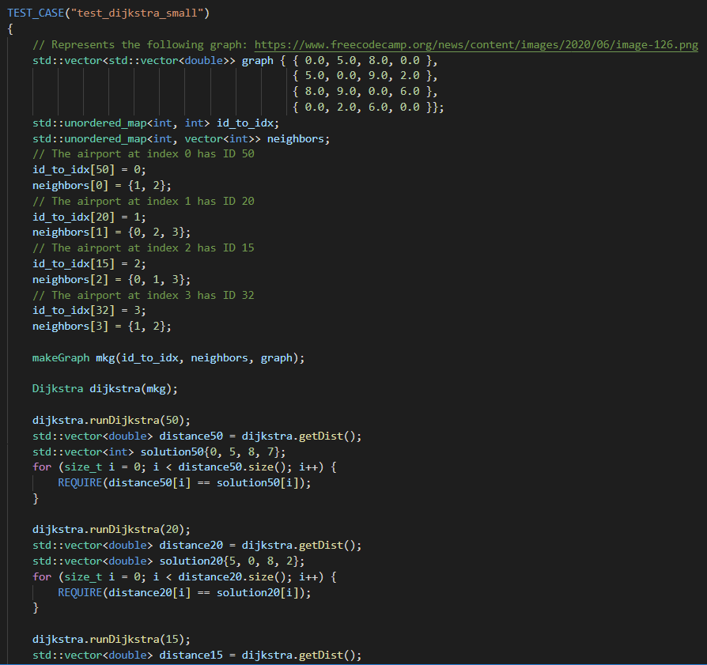
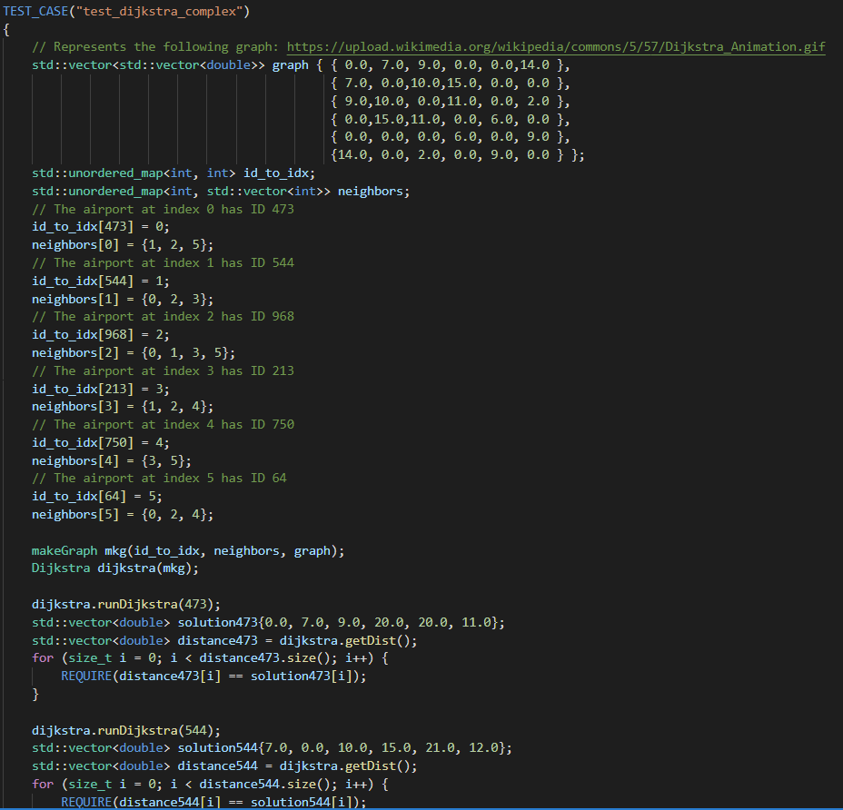

# harsha4-saraza2-kushal2-mayan3 Final Project

## Leading Question
Answer to leading question
How did you answer question?
What did you discover?

## DFS
Output and correctness of DFS
Summarize, visualize, or highlight full-scale run of algorithm
Describe tests used to confirm algorithm worked as intended

## Dijkstra
We employ the Dijkstra algorithm to determine the minimum distance between two airports.

We first verified the correctness of Dijkstra using small, artificial test cases, such as those shown below. We constructed our variant of an adjacency matrix (a 0 entry indicates the lack of an edge between two airports, while a non-zero entry indicates the distance between two airports) for each of these test cases. We arbitrarily assigned each node IDs, and we created a special makeGraph constructor to enable these test cases. Since these graphs are relatively small, it was feasible to test that the minimum distance from every node to every other node was what we expected:

Graph (source: freeCodeCamp)| Corresponding test case
:-------------------------:|:-------------------------:
  |  

Graph (source: Wikimedia Commons)| Corresponding test case
:-------------------------:|:-------------------------:
  |  

We then tested our algorithm on the graph itself. Determining the minimum distance between two airports was challenging, given that there were often several possible routes between two airports which did not have a direct flight between them. We identified four possible scenarios:

1) The user wants to determine the minimum distance between an Airport A and Airport A (itself). We tested this scenario by verifying that Dijkstra outputted 0 when the user inputted the airport ID corresponding to JFK as both the source and destination ID.
```
REQUIRE(dijkstra.minDist(3797, 3797) == 0);
```
2) The user wants to determine the minimum distance between an Airport A and an Airport B, where there is a direct flight between Airport A and Airport B. We tested this scenario by verifying that the Dijkstra outputted the orthodromic distance between JFK and EZE when the user inputted the airport ID corresponding to JFK as the source airport nd the airport ID corresponding to EZE as the destination airport.
```
REQUIRE(dijkstra.minDist(3797, 3988) == mkg.routeDistance(mkg.getAirportIndex(3797), mkg.getAirportIndex(3988)));
```
3) The user wants to determine the minimum distance between Airport A and Airport B. There is no direct flight between Airport A and Airport B, but Airport B is somehow reachable from Airport A (i.e. Airport B is reachable from Airport A with some number of stopovers). We tested this scenario by verifying that Dijkstra outputted the sum of the orthodromic distance between JFK and DEL and the orthodromic distance between DEL and CCU when the user inputted the airport ID corresponding to JFK as the source airport and the airport ID corresponding to CCU as the destination airport.
```
double JFKtoDEL = mkg.routeDistance(mkg.getAirportIndex(3797), mkg.getAirportIndex(3093));
double DELtoCCU = mkg.routeDistance(mkg.getAirportIndex(3093), mkg.getAirportIndex(3043));
double JFKtoCCU = JFKtoDEL + DELtoCCU;
REQUIRE(JFKtoCCU == dijkstra.minDist(3797, 3043));
```
4) The user wants to determine the minimum distance between Airport A and Airport B, where Airport B is not reachable from Airport A. We tested this scenario by verifying that Dijkstra outputted the maximum double value when the user inputted the airport ID corresponding to GEA as the source airport and the airport ID corresponding to CCU as the destination airport.
```
REQUIRE(dijkstra.minDist(2001, 3043) == std::numeric_limits<double>::max());
```

## IDDFS
Output and correctness of IDDFS
Summarize, visualize, or highlight full-scale run of algorithm
Describe tests used to confirm algorithm worked as intended


"All project goals are met and: There are clear descriptions, figures, or tables of each method's output on the full target dataset. (Note: Figures can be stored as plain images in your git repo and the link provided in the .md) There is a written discussion of the projects findings that makes and proves a claim that each method was successful. 
